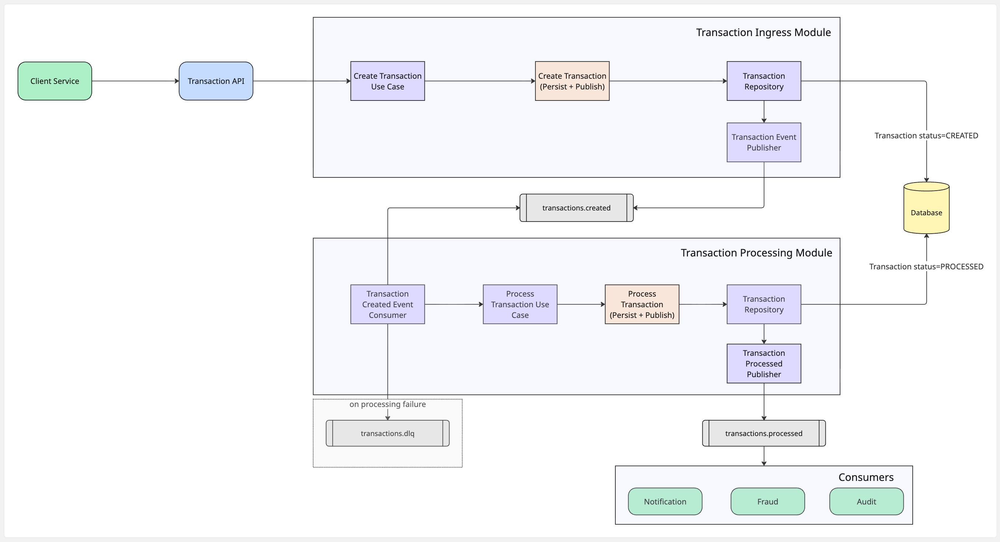

# 🚀 Transaction Stream Processor

---

## 📌 Overview

**Transaction Stream Processor** is an event-driven microservice designed to ingest, validate, and process financial transactions in real time.  
It demonstrates modern distributed-systems concepts used in fintech environments, including:

- Event-driven architecture
- Apache Kafka producers and consumers
- Clean Architecture & modular design
- Transaction persistence
- Dead-letter queue (DLQ) handling
- Outbox-style *“persist + publish”* atomic workflow

This repository is part of my public portfolio and reflects practical experience gained from real-world financial systems.

> 🛠 **Note:** This project is a **work in progress**. New modules, tests, diagrams, and documentation will be added over time.

---

## 🎯 Purpose of the Service

This service focuses specifically on **transaction ingestion and processing**, not balance calculations.  
Its core responsibilities include:

### ✔ **1. Ingesting external transaction requests**
A REST API receives incoming transactions and immediately publishes them to the Kafka topic `TRANSACTIONS.EVENTS`.

### ✔ **2. Processing events asynchronously**
A processing module consumes these events, executes validation rules, and determines the transaction’s outcome.

### ✔ **3. Persisting and publishing results atomically**
A dedicated handler performs:

- transaction persistence
- publication of a new event `TRANSACTIONS.PROCESSED`

This ensures downstream services can react (Fraud, Notification, Audit, etc.).

### ✔ **4. Handling invalid data safely**
Invalid transactions are routed to **`TRANSACTIONS.EVENTS.DLQ`** for later investigation.

---

## 🧩 High-Level Architecture

Place your exported diagram in the folder `docs/diagram.png` and reference it like this:

---

## 🏗 Project Modules

### **1. Transaction Ingress Module**
- Receives external REST requests
- Publishes raw transaction events
- Ensures decoupling between API and processing logic

### **2. Transaction Processing Module**
- Consumes Kafka events
- Applies validation rules
- Executes the use case logic
- Persists transactions
- Publishes processed events
- Sends invalid events to the DLQ

### **3. Downstream Consumers (External)**
These are not part of the service but illustrate event propagation:

- **Notification Service**
- **Fraud Detection**
- **Audit Trail Processor**

---

## 🛠 Tech Stack

- **Java 21**
- **Spring Boot**
- **Apache Kafka** (planned)
- **Clean Architecture** (planned)
- **Docker / Docker Compose** (planned)
- **JUnit + Testcontainers** (planned)

---

## 📌 Roadmap (WIP)

- [ ] Implement ingress API
- [ ] Define Kafka topics and schemas
- [ ] Implement processing use case
- [ ] Add idempotency strategy
- [ ] Add DLQ consumer
- [ ] Add integration tests with Testcontainers

---

## 🤝 Contributing

This repo is part of my professional portfolio but contributions (issues, suggestions, discussions) are welcome.

---

## 📄 License

MIT License — feel free to use this project for learning and inspiration.

---

## ⭐ If you like this project…

Please give it a **star** on GitHub — it helps a lot! 🌟
